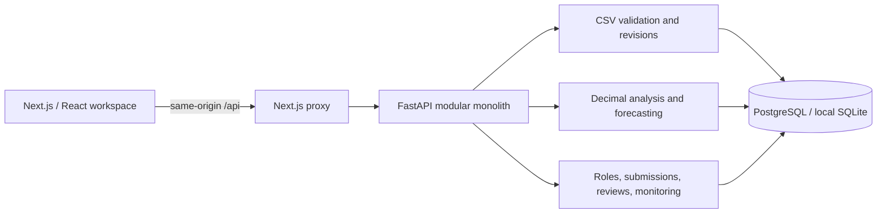
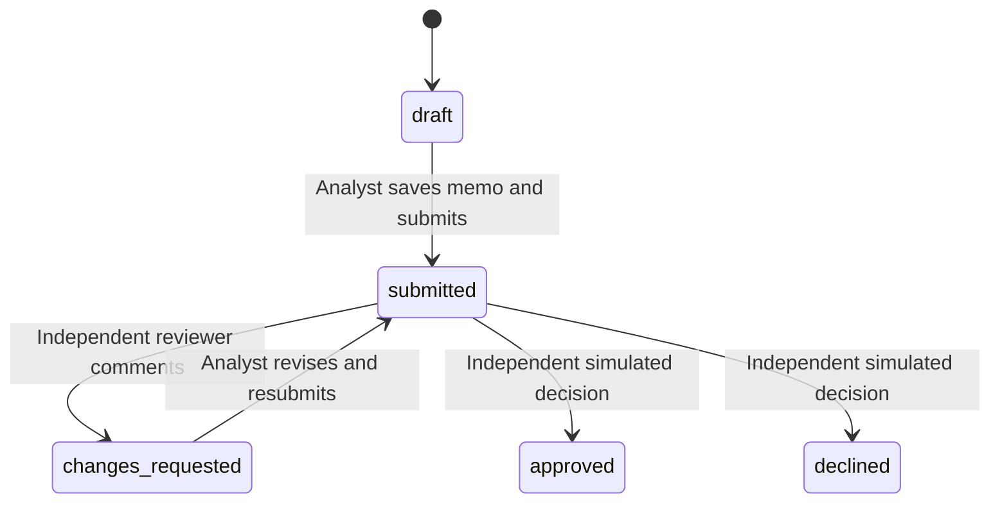

# Architecture and responsibilities

There are two runtime processes because the preferred stack uses TypeScript for the interface and Python for financial work. This is one application with one database, not a collection of microservices. The Next.js proxy keeps browser requests same-origin; there are no browser-held database or AI credentials.

## Code map

| Location | Responsibility |
|---|---|
| `app/page.tsx` | The six workflow views, role-specific controls, requests, feedback, charts |
| `app/globals.css` | Responsive credit-workspace visual system |
| `lib/api.ts`, `lib/types.ts` | Typed API contracts, error handling, display-only formatting |
| `backend/db.py` | SQLAlchemy schema, session factory, current-record selection, audit events |
| `backend/seed.py` | Reproducible synthetic transactions, opening balances, examples |
| `backend/intake.py` | CSV contracts and actionable validation |
| `backend/finance.py` | Historical ratios and deterministic forecast calculations |
| `backend/main.py` | API boundary, role/state checks, transactional workflows, monitoring |
| `backend/tests/` | Financial, authorization, import, and workflow regression tests |

The page is a single workspace route with tab state. It intentionally avoids a routing framework beyond Next.js and a global state library. API state reloads after confirmed mutations. Component-local form state lets analysts review a draft before committing it. PostgreSQL is the standard durable database; SQLite is a portable learning mode, not a claim of production parity under load.

## Persistence design

Source schedules vary in shape, so records use a small relational envelope (`case_id`, kind, key, revision, import) around a validated JSON payload. This preserves the CSV vocabulary and avoids duplicating the same validation in several table-specific importers. Money is serialized as strings, not JSON floating-point numbers. PostgreSQL supports this schema without a SQLite-specific query language.

Imports retain original decoded text, digest, filename, uploader, rows, validation errors, and correction reason. Committed source batches are never edited. Each correction adds record revisions. Unique constraints guard duplicate file hashes and duplicate key/revision combinations. The current view selects the highest revision per logical key. For AR/AP the date is part of the key, so a later snapshot cannot overwrite a submitted historical snapshot.

Case writes use optimistic version checks. SQLAlchemy rejects a concurrent stale case update; the whole transaction rolls back. Import commits recheck the case lock and row conflicts rather than trusting an earlier preview. Submitted scenarios must still reproduce from current source data before the submission can be accepted.

Submissions freeze the memo, profile, analysis, scenario, full source-record view, and source import identifiers. Reviewer comments live in separate review records. Monitoring configuration can evolve without altering previous submission snapshots. Events record actors and changes to imports, cases, scenarios, memos, reviews, conditions, and alert follow-ups.

## Review state machine

Approved/declined cases are terminal for that case review. Later reporting remains possible. Analysts cannot review cases, reviewers cannot edit financial analysis, and owners/authors cannot approve their own submission. These checks run in FastAPI, not just disabled frontend buttons. Simulated approval creates no disbursement record or payment side effect.

## Local authentication boundary

The sign-in screen selects one of two hardcoded demo identities. FastAPI issues a random 256-bit session token, stores only its SHA-256 hash with a 12-hour expiry, and returns an HttpOnly/SameSite=Strict cookie. Sign-out invalidates the server token. Switching identity invalidates the previous session. Requests from nonlocal browser origins cannot mutate data. Backend and frontend launch scripts bind to loopback.

This is intentionally convenient for a portfolio walkthrough. Anyone with local access can select either identity; it is not real-user authentication. Cookie `Secure` is not set because the local development server uses HTTP. `DEMO_MODE=false` refuses startup until production identity integration exists. It must not be publicly hosted as written.

Supabase could later supply JWT identity and object storage, while FastAPI continues to enforce business rules. It was not configured here, so there are no fake integrations or client-side service-role keys. Real deployment also needs tenancy, explicit borrower access assignments, secure sessions/TLS, request limits, operational audit controls, and backup/recovery testing.

## Monitoring semantics

Only supported metric/period combinations are accepted: maximum monthly DSO and minimum trailing-year DSCR. The definition is part of the condition contract; a covenant cannot silently switch to a different numerator or period. Comparisons use unrounded decimals. Insufficient data generates a data-quality alert, not a breach. Missing-report deadlines use an explicit evaluation clock.

One alert exists per case/rule/period. Repeated evaluation is idempotent. Open alerts can receive updated detail, but resolved alerts retain their outcome. A later-period finding creates another work item. Assignment and resolution notes are persisted and audited.

## Extending the project

The first production-oriented extension should be identity and tenancy, followed by migrations and independent financial model validation. The current prototype creates its schema on startup; existing deployed databases must not be evolved this way. Add Alembic migrations before changing a persistent shared schema.

AI drafting would be a separate optional server-side adapter, fed a frozen, explicitly selected analysis snapshot. It should return a draft for human editing, never mutate numeric results or trigger decisions. Document extraction should similarly produce a preview requiring validation before it becomes a source record. Neither extension is needed to run this milestone.
